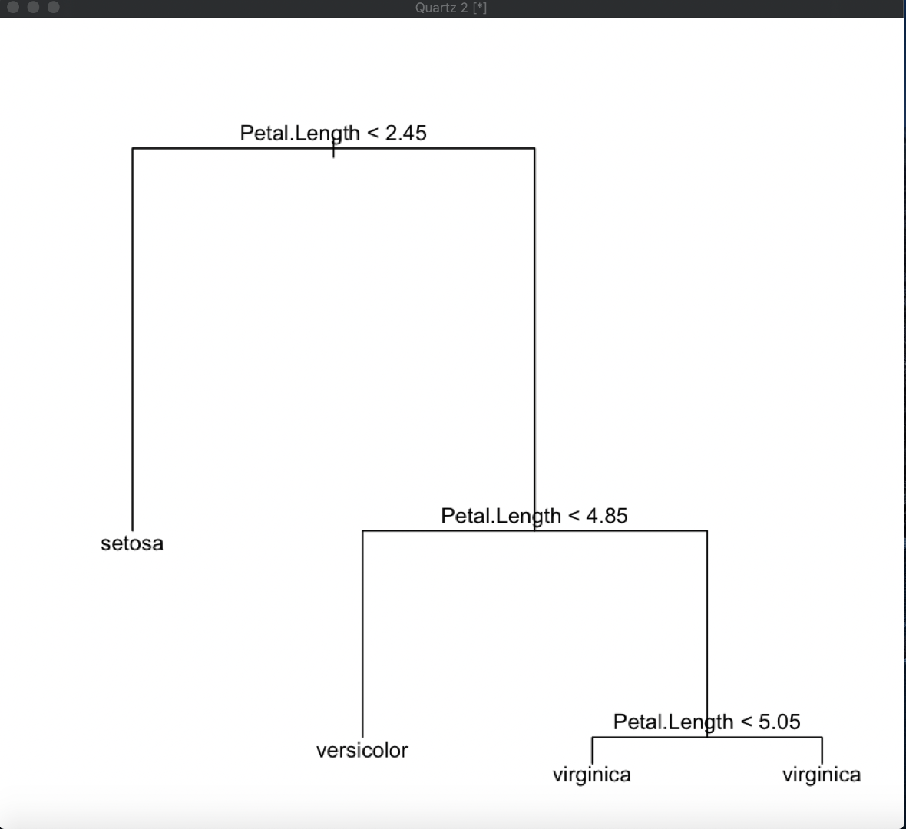
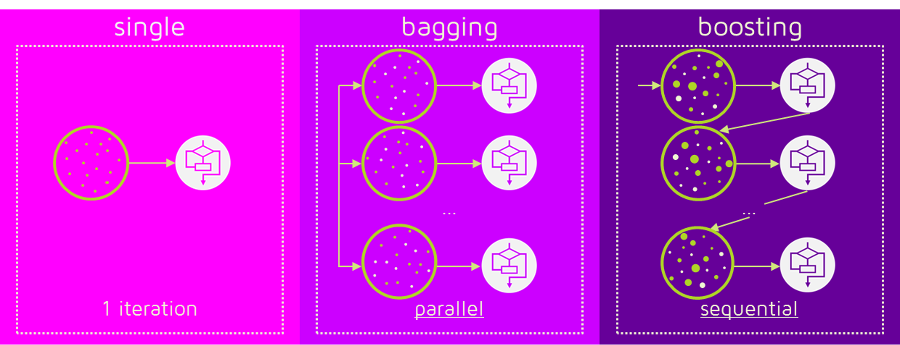
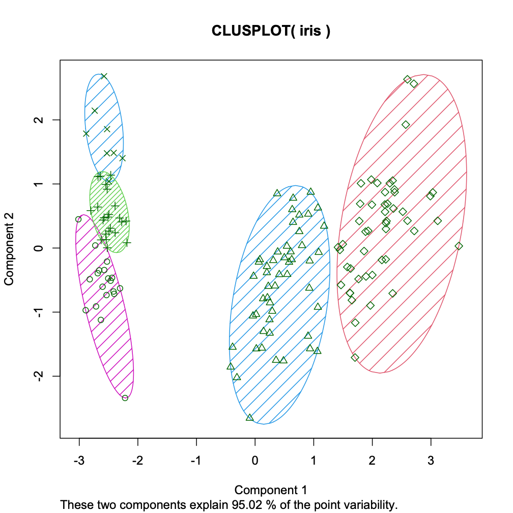
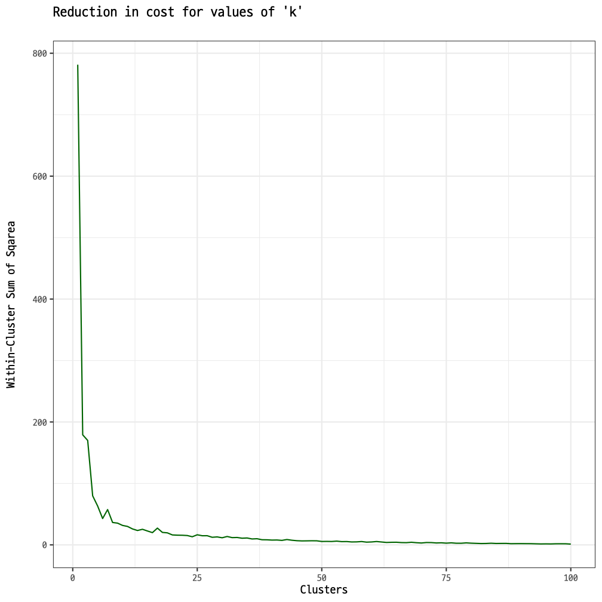
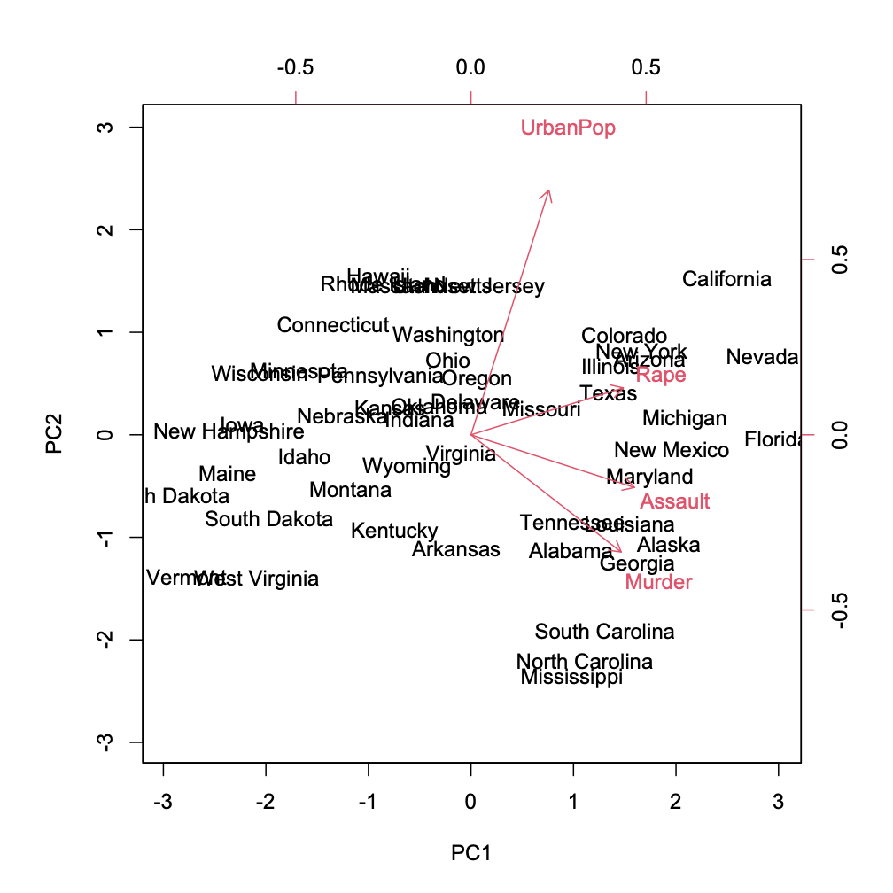
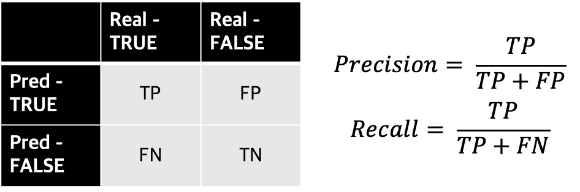

4장: 추천 엔진에서 사용되는 데이터 마이닝 기법
====================================

# 1. 이웃 기반 기법
[R 구현](./r/neighbor_method.r)
- 데이터의 유사도 및 거리를 계산하는 방법
- 유클리드 거리, 코사인 유사도, 자카드 유사도, 피어슨 상관계수

## 1) 유클리드 거리
- 두 점이나 벡터 사이의 거리를 구하는 방법

## 2) 코사인 유사도
- 두 벡터의 내적을 활용한 유사도 계산
- 벡터가 이루는 각을 기준으로 유사한 정도를 구한다.
  - 유사한 벡터: 벡터가 이루는 각이 작다. 코사인 유사도 값이 1
  - 두 벡터가 직교하는 경우 코사인 유사도는 0이 된다.
  - 두 벡터가 반대 방향인 경우 코사인 유사도는 음수가 될 수 있다.

## 3) 자카드 유사도
- 아이템의 합집합과 교집합의 비율로 계산한다.

## 4) 피어슨 상관 계수
- 두 벡터의 상관관계를 구하는 대표적인 방법이 피어슨 상관계수이다.
- 두 벡터의 공분산을 사용해서 상관계수를 구한다.
  - 커질때 같이 커지고, 작아질때 같이 작아지면(공분산이 크면) 상관 계수 값이 커진다.

# 2. 수학적 모델 기법
[Python 구현](./python/matrix_factorization.py) [R 구현](./r/matrix_factorization.r)
- Matrix Factorization을 통해서 저차원의 Latent Feature를 찾는다.
  - 사람들이 영화를 평가하는데 기준이 되는 숨겨진 특징을 Latent Feature라고 한다.
- 저차원의 Latent Feature를 기반으로 유사도 방식의 추천 시스템의 성능을 개선할 수 있다.
- Matrix Factorization의 방법으로는 Gradient Descent, ALS, Singular Vector Decomposition이 있다

## 1) (Stochastic) Gradient Descent
- 사용자x아이템 행렬의 빈 값을 예측하기 위해서 사용자xFeature와 아이템xFeature 행렬로 분해
- 추측한 평가와 원래 평가의 차이가 최소가 되도록 학습을 진행

## 2) ALS (Alternate, Least Square)
- Gradient Descent 처럼 추측한 평가와 원래 평가의 차이가 최호가 되도록 학습을 진행
- ALS는 사용자 또는 아이템을 상수항으로 간주하여서 Loss Function이 이차식의 간단한 형태로 구성
  - 빠른 미분 계산 가능
- 일반적으로 Matrix Factorization은 일반적인 Gradient Descent 보다 ALS 사용해서 최적해 도달

## 3)SVD(Singular Vector Decomposition)
- 행렬을 U, S, V로 분해. 사용자의 크기가 m이고 아이템의 크기가 n일 때 k개의 Singular Value를 선택할 경우
  - U: mxk 행렬
  - S: kxk 대각행렬
  - VT: kxn 행렬

# 3. 머신 러닝 기법
- 정답 데이터가 있는 지도 학습 과제로 회귀와 분류 과제가 있다.
- 추천 시스템의 과제는 정답 데이터(평점 또는 선호)를 파악하는 머신 러닝 과제로 볼 수 있다. 

## 1) 선형 회귀 (Linear Regression)
- [R 구현](./r/linear_regression.r)
- 정답 데이터가 연속형 변수인 회귀 과제이다.

## 2) 선형 분류 (Logistic Regression)
- [R 구현](./r/logistic_regression.r)
- 정답 데이터가 클래스인 분류 과제이다.
- Logistic 함수를 사용한다.

## 3) KNN 분류
- [R 구현](./r/knn_classification.r)
- 최근접 이웃에 따라서 클래스가 결정되는 분류 방법이다.
- 비모수 접근 방법으로 비선형적인 데이터에 효과가 있다.
- 추천 시스템에 광범위하게 사용한다

## 4) SVM 분류
- [R 구현](./r/svm_classification.r)
- 마진을 최대화하는 초평면을 찾는 분류 방법이다.
  - 마진: 서포트 벡터와 초평면 사이의 거리
  - 서포트 벡터: 클래스의 경계에 위치하여서 초평면과 가장 가까운 벡터
- 비선형 데이터를 위해서 커널 기법을 사용한다.

## 5) Decision Tree 분류
- [R 구현](./r/decision_tree.r)
- 변수의 조건에 따라서 트리를 확장하면서 분류하는 방법이다.

## 6) 앙상블 기법
- 단일 모델이 아니라 다수의 모델을 결합하여서 높은 성능을 도모하는 방법
- 배깅과 부스팅으로 구분한다,
  - 배깅: 모델을 단순 가중 합하여 결과를 생성. [R 구현](./r/random_forest.r)
  - 부스팅: 이전에 구축한 모델 정보를 활용해서 점진적으로 정확한 오차를 줄여가능 방식으로 모델을 결합 [R 구현](./r/gradient_descent_boosting.r)

# 4. 클러스터링 기법
- [R 구현](./r/k_means_clustering.r)
- 정답 데이터가 없는 비지도 학습
- 데이터를 보고 유사한 클러스터를 찾는다. 대표적으로 K - Means Clustering이 있다.
  - 클러스터 할당과 중심 이동 단계를 반복하여서 k개의 사전 정의한 클러스터를 생성한다
  - 사전 정의한 클러스터 개수 k는 Elbow Method로 결정한다.

# 5. 차원 축소
- [R 구현](./r/pca.r)
- 정답 데이터가 없는 비지도 학습
- 차원의 저주를 피하기 위해 차원 축소는 필수적
  - 차원의 저주: 데이터의 차원이 커지면서 관측 데이터가 차원 공간에서 차지하는 공간의 비율이 희소해지는 문제
- 대표적인 차원 축소 방법이 PCA
  - 선형 대수를 활용한 차원 축소 (데이터의 선형 관계 기반)
  - 데이터의 고유 벡터를 찾으며, 고유벡터에 관측 데이터를 사영한다. 이때 사영된 데이터의 분산이 최대가 된다.
  - 분산이 최대가 되는 고유 벡터들이 데이터의 Pricipal Complnent이다.

# 6. 벡터 공간 모델
- [R 구현](./r/tdm.r)
- 텍스트를 벡터로 표현하는 방법
  - 1) 단어 빈도 활용(TF): 문헌에 속한 단어의 개수를 세어서 벡터화
  - 2) 단어-역문헌 빈도 (Tf-Idf): 단어 빈도와 문헌 빈도를 고려하여서 희소한 단어일 수록 높은 가중치를 주는 벡터화 방법
- 텍스트를 벡터화하거나 추천 시스템에서 아이템을 아이템의 특징으로 벡처화할 때 사용

# 7. 평가 기법
- 과소 적합(Unserfitting)과 과대 적합(Overfitting)을 모두 피하는 모델이 좋은 모델
  - 과대 적합을 피하기 위해 교차 검증(cross validation)과 정규화(normalization) 수행
- 모델의 주요 평가 지표로는 RMSE, MAE, Precision과 Recall이 있다.

