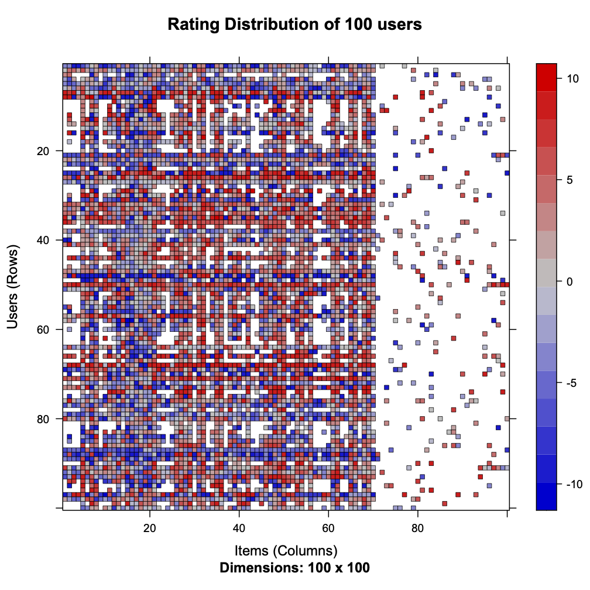
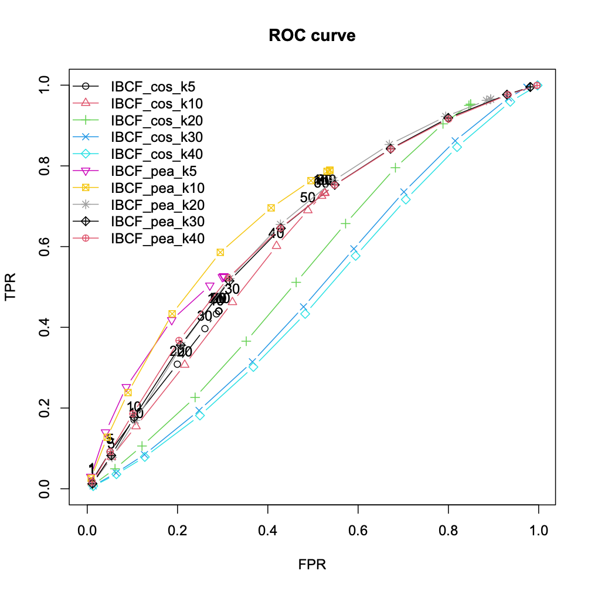

5장: 협업 필터링 추천 엔진 구축하기
====================================

# 1. Jester 5K
- R로 구현한 Collaborative Filtering 추천 시스템
- 평가 개수가 80개 이하인 사용자 데이터만을 추려서 학습 데이터와 검증 데이터로 구분
- 5-fold로 검증하며 evaluationScheme 클래스 사용
  - 검증 데이터에는 일부 평점이 숨겨져 있음
- RMSE, MAE, Precision and Recall로 평가

## 1) User Based Collaborative Filtering
- [R 구현](./r/user_cf.r)
- 취향이 유사한 사용자를 찾아서 추천

## 2) Item Based Collaborative Filtering
- [R 구현](./r/item_cf.r)
- 유사한 아이템을 기반으로 추천
- 파라미터 튜닝을 통한 최적의 값 구함

- 

# 2. Movielens
- Python로 구현한 Collaborative Filtering 추천 시스템

## 1) User Based Collaborative Filtering
- [Python 구현](./python/user_cf.py)
- KNN을 사용하는 것이 성능을 높인다.

## 2) Item Based Collaborative Filtering
- [Python 구현](./python/item_cf.py)
- 데이터에 있는 아이템을 기준으로 유사한 아이템을 찾는다.
