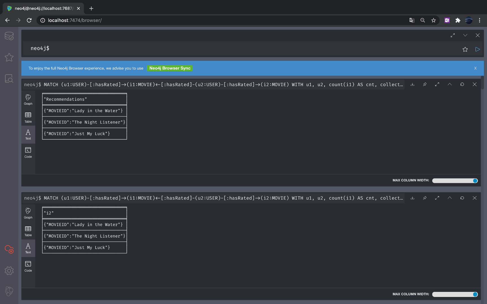

8장: Neo4j로 실시간 추천 엔진 구축하기
====================================

# 1. Neo4j: 그래프 기반 NoSQL 데이터베이스
- 그래프 기빈의 NoSQL 데이터베이스 엔진
  - 노드와 에지로 표현한다
  - 노드는 대상을 나타내며, 에지는 대상 간의 관계를 의미한다.
  - 노드와 에지에 속성(Property)을 부여할 수 있다.
- Neo4j에서 데이터를 처리하는 명령을 Cypher라고 한다.
  - 전통적인 SQL은 데이터를 처리하는 '방법'을 알려주는 절차 지향적 언어이다,
  - 그래프 기반의 데이터베이스 처리언어인 Cypher는 '무엇'을 처리할 것인지 알려주는 선언적 언어이다.
- 기본적인 문법: (노드 라벨:노드)-[관계 라벨:관계]->(노드 라벨:노드)
  - (u1:User)-[f:friendOf]->(u2:User)

## Noe4j in Docker
- Docker Hub에서 Neo4j 이미지 제공
- Docker에서 Neo4j를 실행시키고 동시에 파일을 Neo4j에서 사용할 수 있도록 하는 [명령](./docker.sh)
```
$ docker run \
  --publish=7474:7474 --publish=7687:7687 \
  --volume=$HOME/neo4j/data:/data \
  --volume=$HOME/neo4j/import:/var/lib/neo4j/import \
  neo4j
```
- import 폴더에 Neo4j에서 로드할 CSV 파일을 저장한다.




# 2. Neo4j 사용하기
- [기본적인 사용 스크립트](./neo4j_basic.script)


- [추천 시스템을 위한 스크립트](./neo4j_rating.script)


